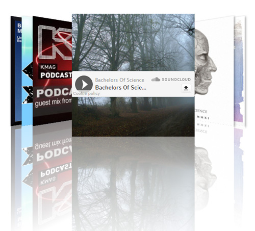

Soundcloud Coverflow
===================
##Showcase your Soundcloud sets

###Instructions
* Install the plugin in Wordpress
* Open the "Soundcloud Coverflow" options page
* Paste the URL of your Soundcloud set into the "Soundcloud URL" field. Pick a different colour for the player if you want and save the options
* Use the [coverflow] shortcode to embed the set anywhere on your site

###Issues
* Loading from Soundcloud is sloooow. If you're adding a 240-track dubstep megamix be prepared to wait a while
* Swiping on mobile works pretty well but could be ready faster

###Planned improvements
* Let users build sets out of individual tracks
* Have multiple coverflows on the same site
* Allow users to change the size of the covers
* Add the option of a black reflection for dark-coloured themes
